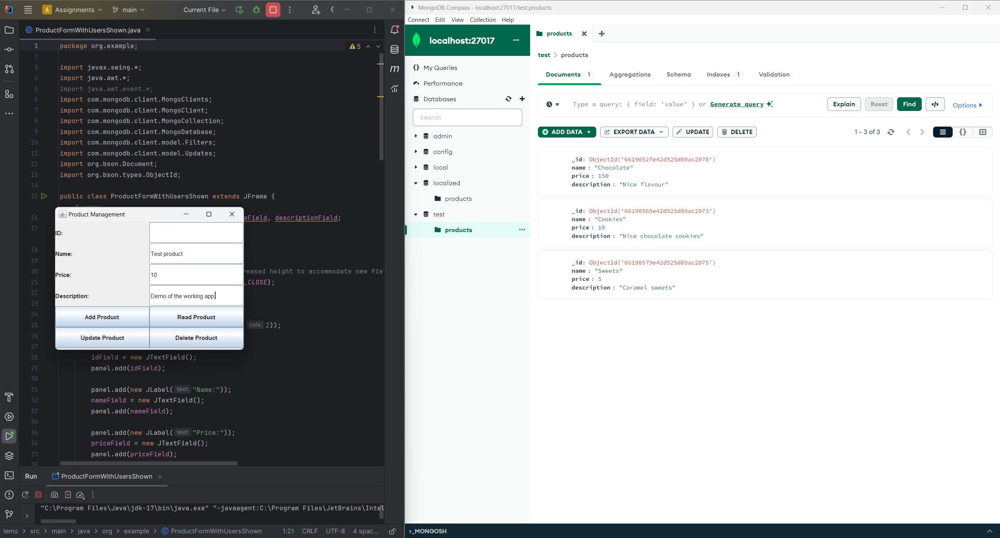
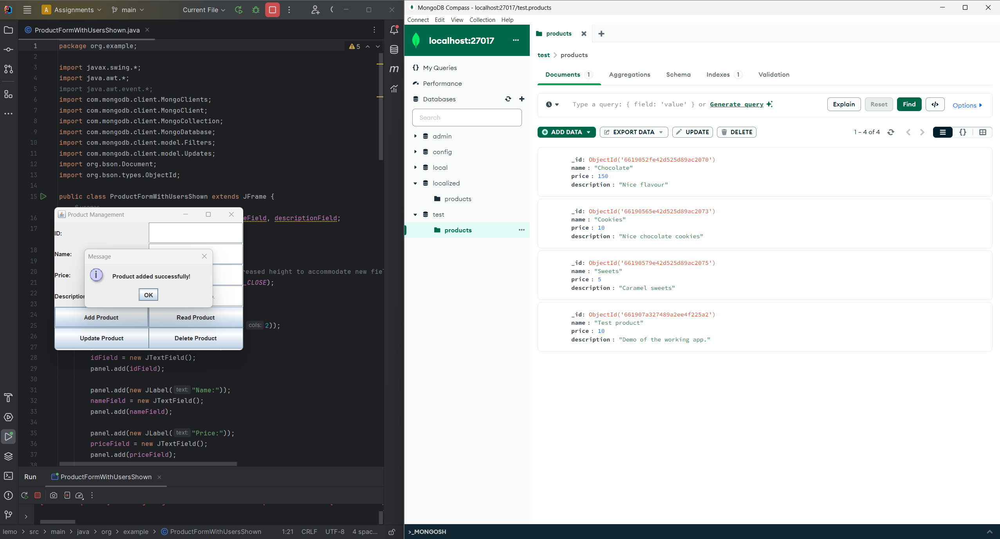
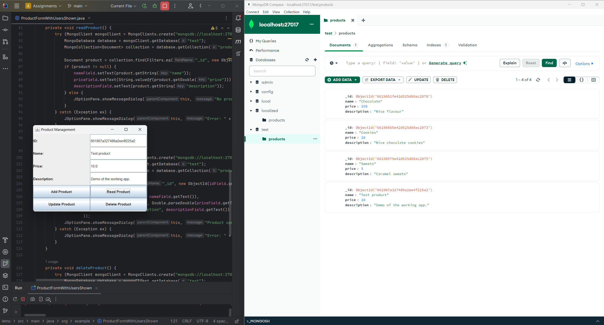
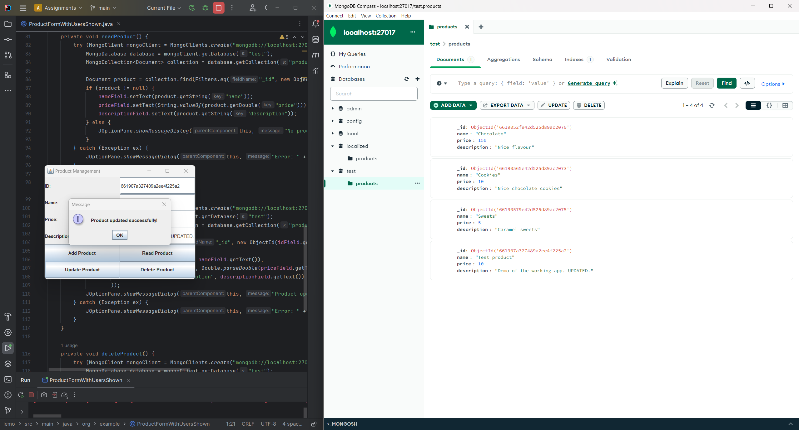
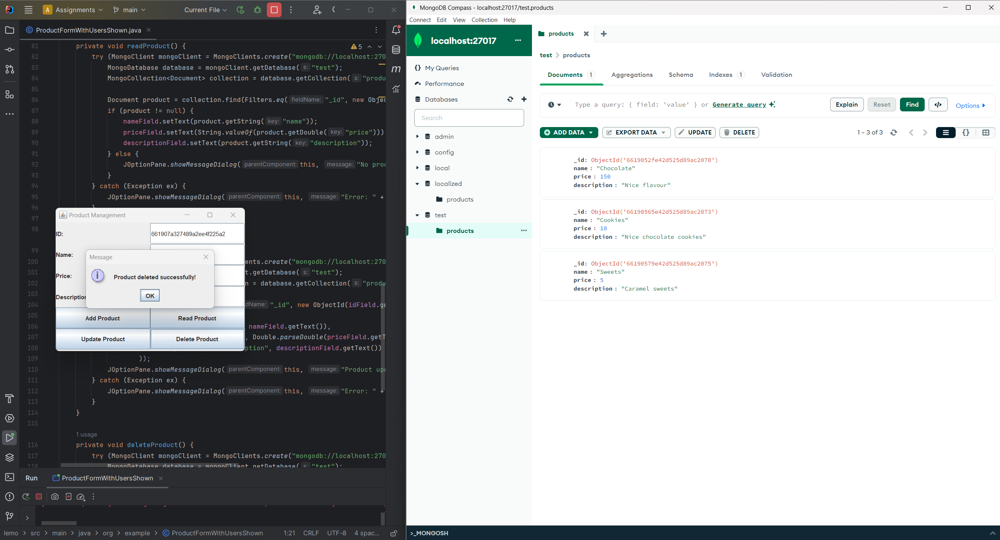

# Product Management Application

This application allows users to manage products in a MongoDB database using a Java Swing interface. It supports basic CRUD (Create, Read, Update, Delete) operations. Below is a breakdown of the functionalities associated with each button.

## Add Product

**Functionality**: Adds a new product to the database with the details entered in the Name, Price, and Description fields.

**Usage**:
1. Enter the product name, price, and description.
2. Click the "Add Product" button.

**Screenshots**:

## Read Product

**Functionality**: Retrieves the details of a product based on the product ID entered in the ID field.

**Usage**:
1. Enter the product ID.
2. Click the "Read Product" button.
3. The product details will populate the Name, Price, and Description fields.

**Screenshot**:

## Update Product

**Functionality**: Updates the details of an existing product. The product to update is identified by the ID entered in the ID field.

**Usage**:
1. Enter the product ID and click the "Read Product" button to load the current product details.
2. Modify the Name, Price, and/or Description fields as needed.
3. Click the "Update Product" button.

**Screenshot**:

## Delete Product

**Functionality**: Deletes a product from the database based on the product ID entered in the ID field.

**Usage**:
1. Enter the product ID.
2. Click the "Delete Product" button.
3. The product will be removed from the database.

**Screenshot**:

